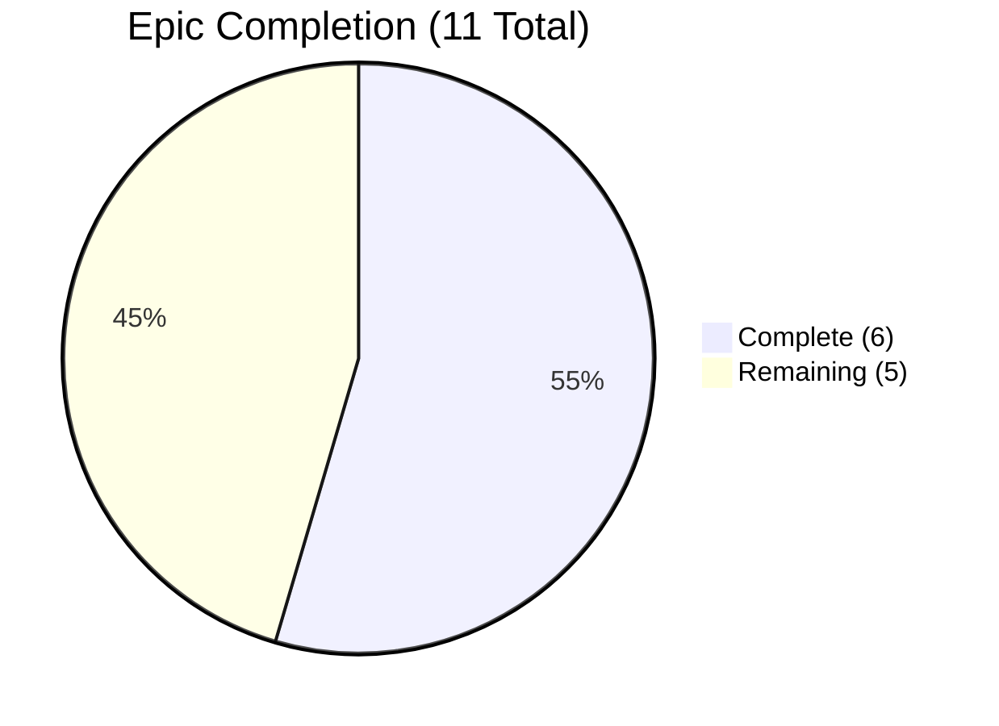
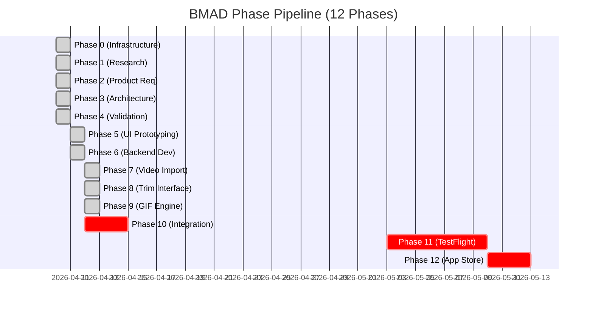

# ClipForge Dashboard

> **ClipForge** — Paste a social media link, get a trimmed GIF in seconds.
> 
> *Last updated: 2026-04-12 | Sprint 2 in progress*

---

## Progress Overview

---

## Phase Timeline

---

## Sprint Status

### Sprint 2 — In Progress

**Focus:** Epics 5 and 6 COMPLETE; next up is Phase 10 Integration & Polish (Epic 7 and error handling)

**Current Activities:**
- ✅ Phase 9 (GIF Engine + Export) — COMPLETE. All 5 stories Epic 5 + Epic 6 implemented (April 12)
- ✅ Phase 8 (Trim Interface) — COMPLETE. All 5 Epic 4 stories implemented (April 12)
- ✅ Phase 7 (Video Import) — COMPLETE. All 5 Epic 3 stories implemented (April 12)
- ✅ **FIRST XCODE BUILD SUCCESSFUL** (April 12) — App compiles and runs in simulator. Build fixes applied: ImportState extraction, Inter variable font, deinit concurrency fix.
- 🔄 Resolving EXTRACT-CONFIG blocker (yt-dlp proxy/cookies) before E2E testing
- ⬜ Rex adding font files (JetBrains Mono + Inter) to Xcode project
- ⬜ SM writing stories for Phase 10: end-to-end flow testing, error handling, Epic 7 (Premium Features)

> [!warning] **Sprint 2 Backlog — Carry-Forward Items**
> 
> **EXTRACT-CONFIG (CRITICAL)**
> - All yt-dlp extractions return 502 during smoke testing
> - Root cause: Railway datacenter IPs blocked by social media platforms
> - Fix: Configure yt-dlp with browser cookies (`--cookies` flag) and/or residential proxy
> - Blocks: Phase 10 end-to-end flow testing until resolved
> 
> **AUTH-FIX (LOW)**
> - Missing X-API-Key header returns 422 instead of 401
> - Fix: Add custom middleware to intercept missing headers and return proper 401
> - Status: Deferred to Sprint 2 polish phase
> 
> **Concurrency Warnings (LOW)**
> - 7 Swift Sendable warnings in code generation and state management
> - Status: Deferred to Phase 10 polish; does not block build or testing
> 
> **Visual Polish (MEDIUM)**
> - Button animations, loading ring transitions, transition timing refinement
> - Status: Deferred to Phase 10 polish after EXTRACT-CONFIG resolution

---

## Epic Tracker

| Status | Epic | Description | Stories | Link |
|--------|------|-------------|---------|------|
| ✅ | Epic 1 | iOS App Shell | 3/3 | [[Epic 1 — iOS App Shell]] |
| ✅ | Epic 2 | Backend API | 5/5 | [[Epic 2 — Backend API]] |
| ✅ | Epic 3 | iOS Video Import Flow | 5/5 | [[Epic 3 — Video Import Flow]] |
| ✅ | Epic 4 | Trim Interface | 5/5 | [[Epic 4 — Trim Interface]] |
| ✅ | Epic 5 | GIF Encoding Engine | 2/2 | [[Epic 5 — GIF Encoding Engine]] |
| ✅ | Epic 6 | Export + Gallery | 3/3 | [[Epic 6 — Export & Gallery]] |
| ⬜ | Epic 7 | Premium Features | 0/? | [[Epic 7 — Premium Features]] |
| ⬜ | Epic 8 | Subscription (StoreKit 2) | 0/? | [[Epic 8 — Subscription (StoreKit 2)]] |
| ⬜ | Epic 9 | Error Handling + Recovery | 0/? | [[Epic 9 — Error Handling & Recovery]] |
| ⬜ | Epic 10 | Performance Optimization | 0/? | [[Epic 10 — Performance Optimization]] |
| ⬜ | Epic 11 | App Store Submission | 0/? | [[Epic 11 — App Store Submission]] |

**Total Stories:** 23 complete / ~40-50 estimated

---

## Development Status

### Completed Components

> [!success] **Phase 6: Backend API — COMPLETE**
> - FastAPI server with health, extract, and media endpoints
> - yt-dlp integration with proper error handling
> - Signed URL authentication for media delivery
> - Deployed to Railway: `clipforge-production-f27b.up.railway.app`
> - Smoke tests: 11/11 pass (extraction 502s are infrastructure, not code)

> [!success] **Phase 1–4: Planning & Architecture — COMPLETE**
> - Market research, competitive analysis, user personas
> - Product requirements with all features and acceptance criteria
> - Full system architecture (two-tier: iOS + Python backend)
> - API contract with endpoint specs and signed URLs
> - 11 development epics scoped and sequenced

> [!success] **Phase 0: Project Infrastructure — COMPLETE**
> - CLAUDE.md master context
> - Obsidian vault structure
> - BMAD pipeline initialized
> - Chat, Cowork, Code configurations

### In Progress

> [!success] **Phase 5: UI Prototyping — COMPLETE (2026-04-12)**
> - Design system finalized (JetBrains Mono + Inter, light mode with vermillion gradient)
> - Home screen (single CTA button, auto clipboard detect) — design complete
> - Video Player screen — design complete
> - Trim Modal (iOS Photos-style) — design complete
> - GIF Encoding Progress (in-modal loading ring) — design complete
> - Export Success (in-modal completion state) — design complete
> - Media Library (share sheet integration) — design complete
> - Menu button and supplemental UI elements — design complete
> - Figma file with Apple iOS 26 design kit and Liquid Glass plugin

### Blocked

> [!warning] **Phase 10+: End-to-End Testing — BLOCKED**
> - Cannot proceed with full integration testing until EXTRACT-CONFIG is resolved
> - Backend is functional, but extracting videos from social platforms requires proxy configuration
> - Blockers must be resolved before moving to Phase 11 (TestFlight Beta)

---

## Key Documents

**Master Context:**
- [[CLAUDE]] — Full project state, architecture, design decisions, Karpathy dev principles, cross-references

**Product & Requirements:**
- Project_Brief — Market opportunity, competitive landscape, user personas *(Chat only — not yet in vault)*
- [[PRD]] — Feature set, user flows, acceptance criteria, monetization model
- [[Architecture_Spec]] — System design, MVVM pattern, security considerations
- [[API_Contract]] — Endpoint specifications, schemas, error codes, rate limits

**Planning & Breakdown:**
- [[Epic_Breakdown]] — All 11 epics with scope, dependencies, complexity
- [[Master_Checklist]] — PO validation of alignment and gap resolutions
- [[Screen_Inventory]] — Figma frames → epics → visual specs → component stories

**Design:**
- [[Design System]] — Color palette, typography, spacing, component inventory
- [[Design_Decisions]] — All UI/UX decisions with rationale
- [[Session_Handoff_2026-04-11_v2]] — Design session handoff (preset removal, freemium revision)

**Operations & Compliance:**
- [[APP_STORE_STRATEGY]] — Banned terms, required language, review strategy
- [[BMAD_LOG]] — Development decisions and phase transitions

---

## Recent Activity

| Date | Phase | Activity |
|------|-------|----------|
| 2026-04-12 | Phase 7-9 | **FIRST XCODE BUILD SUCCESSFUL** — App compiles and runs in simulator. Build fixes: ImportState extraction, Inter variable font handling, deinit concurrency fix. 7 Sendable warnings remain (deferred to Phase 10). |
| 2026-04-12 | Phase 9 | Epic 5 (GIF Encoding Engine) COMPLETE: STORY-019, STORY-020 |
| 2026-04-12 | Phase 9 | Epic 6 (Camera Roll Export) COMPLETE: STORY-021, STORY-022, STORY-023 |
| 2026-04-12 | Phase 5 | 6 supplemental design decisions: CREATE GIF loading ring, encoding progress in-modal, export success in-modal, media library share sheet, menu button, Phase 5 closure |
| 2026-04-12 | Phase 5 | UI Prototyping COMPLETE; all screens and supplemental elements finalized in Figma |
| 2026-04-11 | Phase 6 | Backend API deployed to Railway; smoke tests complete (11/11 pass) |

---

## Quick Links

**Deployment:**
- [Railway Dashboard](https://railway.app/project/clipforge-production)
- Backend API: `https://api.clipforge.app/v1` (production) | `https://api-staging.clipforge.app/v1` (staging)

**Design:**
- [Figma File](https://www.figma.com/design/YOUR_FILE_KEY/ClipForge) *(update with actual file key)*

**GitHub:**
- [iOS Repository](https://github.com/YOUR_ORG/clipforge-ios) *(when created)*
- [Backend Repository](https://github.com/YOUR_ORG/clipforge-backend) *(when created)*

---

## Next Steps (Handoff: Resolve Blockers → Mega-Checkpoint)

### Stage 1: Blocker Resolution
1. **CRITICAL: Resolve EXTRACT-CONFIG** — Configure yt-dlp with residential proxy or cookies to unblock social media extraction (blocks all E2E testing)
2. **Verify Font Files** — Confirm JetBrains Mono and Inter .ttf files in Xcode project; rebuild if needed

### Stage 2: Mega-Checkpoint (E2E Testing)
3. **Stage 3 E2E Flow Test** — Full workflow in simulator: paste URL → import → trim → CREATE → encoding → save → success → share
4. **PO Validation** — Acceptance criteria review against CLAUDE.md Phases 7-9 completion criteria

### Stage 3: Story Writing & Backlog Refinement
5. **SM Writes Phase 10 Stories** — End-to-end flow testing, error handling, recovery paths
6. **Epic 7 Planning** — Premium Features stories (watermark removal, daily limit increase)
7. **Deferred: AUTH-FIX, Concurrency Warnings, Visual Polish** — Add to Sprint 2 backlog after EXTRACT-CONFIG resolution

### Stage 4: Phase 10 Implementation (Integration & Polish)
8. **Implement Phase 10 Stories** — Error recovery, edge cases, final polish
9. **Resolve Concurrency Warnings** — Swift Sendable conformance, actor-isolation fixes
10. **Visual Polish Pass** — Button animations, loading transitions, timing refinement

### Stage 5: Phase 11+ (TestFlight & App Store)
11. **TestFlight Beta (Phase 11)** — Build, distribute, gather feedback
12. **App Store Submission (Phase 12)** — Listing, screenshots, metadata, review strategy

---

**Next Sync:** 2026-04-13 (estimated, after EXTRACT-CONFIG resolution)
